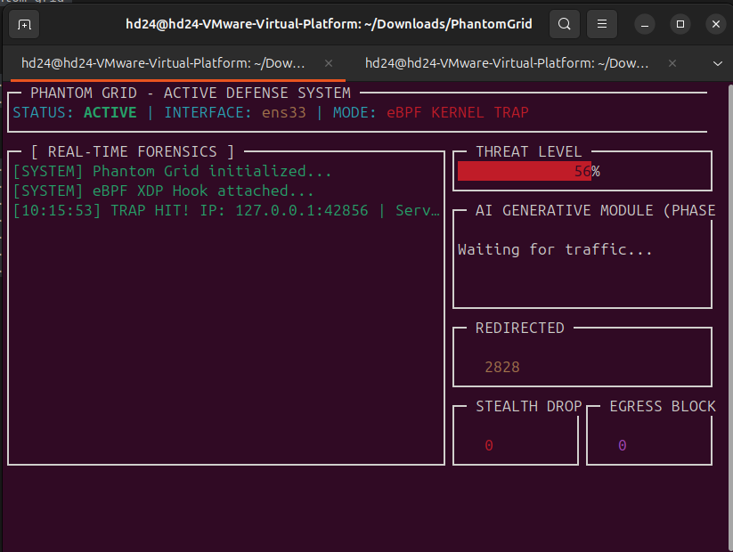

# Phantom Grid – eBPF-Powered Active Defense Platform

> "The best defense is not just blocking – it is confusing, deceiving, and recording."

**Phantom Grid** is a kernel-level active defense system built on **eBPF (Extended Berkeley Packet Filter)** that transforms a standard Linux server into a controlled, deceptive attack surface. It provides enterprise-grade security through deception, zero-trust access control, and real-time threat intelligence.



_Real-time forensics dashboard showing live attack detection, connection statistics, and system metrics_

---

## Table of Contents

- [Features](#features)
- [Architecture](#architecture)
- [Tech Stack](#tech-stack)
- [Getting Started](#getting-started)
- [Usage](#usage)
- [Testing](#testing)
- [Development](#development)
- [Security Considerations](#security-considerations)
- [License](#license)
- [Author](#author)

---

## Features

### Core Defense Mechanisms

- **The Phantom Protocol**  
  Critical assets (SSH, databases, admin panels) are completely invisible by default. All traffic to protected ports is dropped unless the source IP is whitelisted via Single Packet Authorization (SPA). Attackers see a "dead host" while authorized administrators maintain access.

- **The Mirage**  
  Dynamically presents a wide range of seemingly open ports with randomized service banners. Reconnaissance tools see a noisy, misleading surface instead of real services. Each connection receives a randomized service type (SSH, HTTP, MySQL, Redis, FTP, Telnet) with different OS fingerprints, creating an inconsistent "Ghost Grid" that confuses attackers.

- **The Portal**  
  Transparent redirection of suspicious traffic to an internal honeypot without changing the destination IP. All non-critical traffic is silently redirected to the honeypot for analysis and logging.

### Advanced Capabilities

- **Single Packet Authorization (SPA)**  
  Zero-trust access control mechanism. The server is completely invisible by default. Administrators send a Magic Packet (UDP packet with secret token) to port 1337. Upon successful validation, the source IP is whitelisted for 30 seconds, allowing SSH access. This implements the highest level of Zero Trust security.

- **Stealth Scan Detection**  
  Automatically detects and silently drops malicious scan types (Xmas, Null, FIN, ACK scans) at the kernel level, saving honeypot resources and preventing reconnaissance. Statistics are tracked in real-time via BPF maps.

- **OS Personality Mutation**  
  Kernel-level OS fingerprint spoofing. Mutates IP TTL and TCP Window Size in real-time to confuse fingerprinting tools. Attackers see inconsistent OS signatures (Windows, Linux, FreeBSD, Solaris) and may use wrong exploits. Implemented at wire-speed using eBPF.

- **Egress Containment (DLP)**  
  Kernel-level Data Loss Prevention. TC eBPF program monitors outbound traffic from honeypot connections. Detects and blocks suspicious data patterns (password files, SSH keys, base64-encoded data, SQL dumps) before they leave the server. Even if an attacker gains access, data never leaves the server.

- **Real-Time Forensics Dashboard**  
  Terminal-based dashboard (TermUI) provides live visualization of:

  - Incoming connections and trap hits
  - Commands executed by attackers
  - Dynamic threat level gauge
  - Statistics for redirected connections, stealth drops, OS mutations, and SPA authentications
  - Connection statistics (honeypot connections, active sessions, total commands)

- **High Performance**  
  Built on eBPF/XDP, all traffic decisions are made in kernel space with minimal overhead, suitable for modern high-throughput environments.

---

## Architecture

### Kernel Space Components

#### XDP Program (`internal/ebpf/programs/phantom.c`)

The XDP (eXpress Data Path) program is attached to a network interface and processes packets at the NIC driver level for wire-speed performance.

**Key Functions:**

- **Single Packet Authorization (SPA)**

  - Listens for UDP packets on port 1337 containing secret token `PHANTOM_GRID_SPA_2025`
  - Validates token and whitelists source IP (LRU map auto-expires entries)
  - SSH port 22 is completely closed unless source IP is whitelisted
  - Maintains statistics: `spa_auth_success`, `spa_auth_failed`

- **Stealth Scan Detection**

  - Detects and drops: Xmas Scan (FIN+URG+PSH), Null Scan, FIN Scan, ACK Scan
  - Statistics tracked in `stealth_drops` map

- **Transparent Redirection**

  - Fake ports (80, 443, 3306, etc.) are passed directly if honeypot binds them
  - Other ports are redirected to honeypot fallback port 9999
  - Connection tracking via `redirect_map` LRU hash map

- **OS Personality Mutation**

  - Mutates IP TTL (Windows=128, Linux=64, FreeBSD=64, Solaris=255)
  - Mutates TCP Window Size (Windows=65535, Linux=29200, FreeBSD=65535)
  - Uses source port hash for consistent fingerprint per connection
  - Statistics tracked in `os_mutations` map

- **Checksum Recalculation**
  - Sets checksum fields to 0 after modification (kernel recalculates in XDP Generic mode)
  - Ensures packets are not dropped by NIC or OS

#### TC Egress Program (`bpf/phantom_egress.c`)

The TC (Traffic Control) eBPF program monitors outbound traffic for data exfiltration.

**Key Functions:**

- **Pattern Detection**
  - Scans payload for suspicious patterns:
    - `/etc/passwd` format (`root:x:0:0:`)
    - SSH private keys (`-----BEGIN`)
    - Base64-encoded data (95% threshold to avoid false positives)
    - SQL dumps (`INSERT INTO`)
  - Statistics tracked in `egress_blocks` and `suspicious_patterns` maps

### User Space Components

#### Main Agent (`cmd/agent/main.go`)

- Loads and attaches XDP and TC eBPF programs using Cilium eBPF library
- Auto-detects or accepts user-specified network interface
- Starts lightweight TCP honeypot on port 9999 and multiple fake ports
- Implements "The Mirage" with randomized service banners:
  - **SSH**: 8 different OpenSSH versions (Ubuntu, Debian, CentOS, RedHat, Arch, FreeBSD)
  - **HTTP**: Multiple web server signatures (nginx, Apache, IIS)
  - **Database**: MySQL, MariaDB, Redis responses
  - **FTP**: Various FTP server implementations
  - **Telnet**: Multiple Linux distribution login prompts
- Provides interactive service emulation (SSH shells, HTTP servers, MySQL, Redis, FTP)
- Exposes TUI dashboard with real-time forensics and statistics
- Logs all attacker interactions to `logs/audit.json`

#### SPA Client (`cmd/spa-client/main.go`)

- Command-line tool to send Magic Packet for SPA authentication
- Validates token length and provides clear feedback
- Usage: `./spa-client <server_ip>`

---

## Tech Stack

- **Kernel Space:** C, eBPF/XDP, TC
- **User Space:** Go (Golang) 1.21+
- **eBPF Runtime:** `github.com/cilium/ebpf`
- **TUI Dashboard:** `github.com/gizak/termui/v3`
- **Build System:** Make, bpf2go

---

## Getting Started

### Prerequisites

- Linux kernel 5.4+ (Ubuntu 20.04/22.04 recommended)
- `clang`, `llvm`, `libbpf-dev` (eBPF build toolchain)
- Go 1.21 or later
- Root privileges (required for eBPF program loading)

**Install dependencies (Ubuntu/Debian):**

```bash
sudo apt update
sudo apt install -y clang llvm libbpf-dev golang make git
```

### Installation

1. **Clone the repository:**

```bash
git clone https://github.com/YOUR_USERNAME/phantom-grid.git
cd phantom-grid
```

2. **Install Go dependencies:**

```bash
go mod tidy
```

3. **Build the project:**

```bash
make build
```

This will:

- Compile eBPF programs via `bpf2go`
- Build the main agent binary (`phantom-grid`)
- Build the SPA client tool (`spa-client`)

---

## Docker Deployment

### Prerequisites

- Docker Engine 20.10+ with BuildKit support
- Linux kernel 5.4+ on host (required for eBPF/XDP)
- Host network access (XDP requires host network mode)

### Build Docker Image

```bash
docker build -t phantom-grid:latest .
```

### Run with Docker Compose (Recommended)

```bash
# Build and run
docker-compose up -d

# View logs
docker-compose logs -f

# Stop
docker-compose down
```

### Run with Docker (Manual)

```bash
# Build image
docker build -t phantom-grid:latest .

# Run container (requires privileged mode and host network)
docker run -d \
  --name phantom-grid \
  --privileged \
  --network host \
  -v $(pwd)/logs:/app/logs \
  phantom-grid:latest

# Or specify network interface
docker run -d \
  --name phantom-grid \
  --privileged \
  --network host \
  -v $(pwd)/logs:/app/logs \
  -e INTERFACE=eth0 \
  phantom-grid:latest

# View logs
docker logs -f phantom-grid

# Stop container
docker stop phantom-grid
docker rm phantom-grid
```

### Development Container

For development with all tools:

```bash
docker build -f Dockerfile.dev -t phantom-grid:dev .
docker run -it --privileged --network host -v $(pwd):/app phantom-grid:dev
```

**Important Notes:**

- **Privileged Mode**: Required for eBPF program loading (`--privileged`)
- **Host Network**: Required for XDP to attach to network interfaces (`--network host`)
- **Capabilities**: Container needs `SYS_ADMIN`, `NET_ADMIN`, and `BPF` capabilities
- **Kernel Version**: Host kernel must be 5.4+ for eBPF/XDP support

---

## Usage

### Quick Start

#### Option 1: Auto-detect Network Interface (Testing Only)

Chương trình sẽ tự động tìm card mạng:

```bash
sudo make run
# hoặc
sudo ./bin/phantom-grid
```

**Thứ tự auto-detect:**

1. WiFi interfaces (wlx*, wlan*, wlp\*)
2. Common interfaces: ens33, eth0, enp0s3, enp0s8, enp0s9, eth1
3. Fallback: loopback (lo) - **chỉ dùng cho testing local**

> **Warning:** Auto-detect có thể chọn sai interface hoặc fallback về loopback. **Không dùng cho production!**

#### Option 2: Specify Network Interface (Recommended for Production)

**Bước 1: Xem danh sách card mạng có sẵn:**

```bash
ip link show
# hoặc
ifconfig -a
```

**Bước 2: Chạy với card mạng cụ thể:**

```bash
# Cách 1: Dùng Makefile (khuyến nghị)
make run-interface INTERFACE=ens33

# Cách 2: Chạy trực tiếp binary
sudo ./bin/phantom-grid -interface ens33

# Ví dụ với các card mạng khác:
sudo ./bin/phantom-grid -interface eth0      # Ethernet card
sudo ./bin/phantom-grid -interface wlan0      # WiFi card
sudo ./bin/phantom-grid -interface enp0s3     # USB Ethernet
```

**Làm sao biết chọn card mạng nào?**

- **VMware/VirtualBox:** Thường là `ens33`, `enp0s3`, hoặc `eth0`
- **Physical server:** Thường là `eth0`, `eth1`, hoặc `enp*s*`
- **WiFi:** Thường là `wlan0`, `wlx*`, hoặc `wlp*`
- **Kiểm tra IP:** Card mạng có IP address (không phải 127.0.0.1) là card external

**Ví dụ kiểm tra:**

```bash
# Xem card mạng và IP của chúng
ip addr show

# Tìm card có IP external (không phải loopback)
ip addr show | grep -E "^[0-9]+:|inet " | grep -v "127.0.0.1"
```

> **Important:** Luôn chỉ định card mạng external bằng `-interface` flag cho production. Auto-detect có thể chọn sai và không capture được traffic từ bên ngoài.

### SPA Authentication

1. **Verify server is invisible (attacker perspective):**

```bash
# Ping - no response (ICMP is allowed, but SSH is protected)
ping PHANTOM_IP

# Port scan - SSH port appears closed
nmap -p 22 PHANTOM_IP
# Result: Port 22 is filtered/closed - server appears "dead"
```

2. **Send Magic Packet (admin):**

```bash
./spa-client PHANTOM_IP
```

Output:

```
[*] Sending Magic Packet to PHANTOM_IP:1337...
[+] Magic Packet sent successfully!
[+] Your IP has been whitelisted for 30 seconds
[+] You can now SSH to the server:
    ssh user@PHANTOM_IP
```

3. **Access SSH (whitelisted IP):**

```bash
ssh user@PHANTOM_IP
```

4. **Monitor in dashboard:**

- Watch for `[SPA] Successful authentication` messages
- Server remains invisible to non-whitelisted IPs
- Whitelist expires automatically after 30 seconds (LRU map auto-eviction)

---

## Testing

### Basic Functionality Test

1. **Scan from external machine:**

```bash
nmap -p- PHANTOM_IP
```

Expected: Multiple fake ports appear open (80, 443, 3306, 5432, etc.)

2. **Connect to fake port:**

```bash
nc PHANTOM_IP 3306
```

Expected: Randomized service banner (SSH, HTTP, MySQL, Redis, FTP, or Telnet)

3. **Interact with service:**

- **SSH:** Try commands (`whoami`, `ls`, `pwd`, `exit`)
- **HTTP:** Send request (`GET / HTTP/1.1\r\nHost: example.com\r\n\r\n`)
- **MySQL:** Attempt authentication
- **Redis:** Send commands (`PING`, `INFO`)
- **FTP:** Send commands (`USER test`, `PASS test`)

4. **Monitor dashboard:**

- Watch real-time logs of connections and commands
- Check statistics for redirected connections, stealth drops, OS mutations

### Unit Tests

```bash
# Run all tests
make test

# Run tests with coverage
make test-coverage
```

---

## Development

### Project Structure

```
phantom-grid/
├── cmd/
│   ├── agent/             # Main Phantom Grid agent
│   │   └── main.go
│   └── spa-client/        # SPA client CLI tool
│       └── main.go
├── internal/
│   ├── agent/             # Agent core logic
│   ├── config/            # Configuration and constants
│   ├── dashboard/         # Terminal UI dashboard
│   ├── ebpf/
│   │   ├── loader.go      # eBPF loader and bindings
│   │   └── programs/      # eBPF C programs
│   │       ├── phantom.c          # XDP program (ingress)
│   │       ├── phantom_egress.c   # TC program (egress DLP)
│   │       └── phantom_spa.c      # SPA module
│   ├── honeypot/          # Honeypot implementation
│   ├── logger/            # Logging utilities
│   ├── mirage/            # Fake service banners
│   ├── network/           # Network interface detection
│   └── spa/               # SPA manager
├── pkg/
│   └── spa/               # Reusable SPA client package
├── assets/                # Static assets (images, etc.)
├── docs/                  # Technical documentation
├── logs/                  # Runtime logs (gitignored)
├── bin/                   # Build output (gitignored)
├── Makefile
├── go.mod
└── README.md
```

### Regenerating eBPF Bindings

If you modify eBPF programs, regenerate Go bindings:

```bash
go generate ./...
```

### Building

```bash
# Build all binaries
make build

# Clean build artifacts
make clean
```

### Contributing

Contributions are welcome!  
Please read:

- [`CONTRIBUTING.md`](CONTRIBUTING.md) – development workflow, coding style, and PR checklist
- [`CODE_OF_CONDUCT.md`](CODE_OF_CONDUCT.md) – rules for respectful, professional collaboration
- [`SECURITY.md`](SECURITY.md) – how to report vulnerabilities responsibly
- [`CHANGELOG.md`](CHANGELOG.md) – project version history

For detailed technical documentation, see the [`docs/`](docs/) directory.

### Docker Deployment

See [`docs/DOCKER.md`](docs/DOCKER.md) for complete Docker deployment guide.

### Dashboard Controls

- `j` / `k`: Scroll down/up in log panel
- `g` / `G`: Scroll to top/bottom
- `a`: Toggle auto-scroll
- `SPACE`: Pause/resume log scrolling
- `q` / `Ctrl+C`: Exit

---

## Security Considerations

### Production Deployment

1. **Network Interface Selection**

   - Always specify external interface using `-interface` flag
   - Avoid loopback interface for production
   - Verify interface detection is working correctly

2. **SPA Token Security**

- Default token is `PHANTOM_GRID_SPA_2025` (21 bytes)
- For production, modify `SPA_SECRET_TOKEN` in `internal/ebpf/programs/phantom.c` and rebuild
- Keep token secret and rotate periodically

3. **Port Binding**

   - Ports < 1024 require root privileges
   - Run with `sudo` to bind all fake ports
   - Ensure port 9999 (honeypot fallback) is available

4. **Firewall Rules**

   - XDP operates before iptables/firewalld
   - Ensure no conflicting firewall rules
   - ICMP is allowed for network connectivity

5. **Performance**

   - XDP Generic mode is used for VMware/virtual interface compatibility
   - For native XDP performance, ensure driver support
   - Monitor system resources (CPU, memory)

6. **Logging**
   - All attacker interactions logged to `logs/audit.json`
   - Implement log rotation for production
   - Consider integration with SIEM platforms

### Limitations

- XDP programs attached to external interfaces do not process localhost traffic
- TC Egress DLP may require specific netlink APIs (gracefully degrades if unavailable)
- SPA whitelist expiry is handled by LRU map auto-eviction (30 seconds approximate)

---

## License

This project is released under the MIT License. See `LICENSE` for details.

---

## Author

**Mai Hai Dang – HD24SecurityLabs**

Focus areas: system programming, eBPF, and active defense.

---

## Acknowledgments

Built with:

- [Cilium eBPF](https://github.com/cilium/ebpf) - eBPF library for Go
- [TermUI](https://github.com/gizak/termui) - Terminal dashboard library

---

**WARNING:** This tool is for authorized security testing and research purposes only. Use responsibly and in compliance with applicable laws and regulations.
